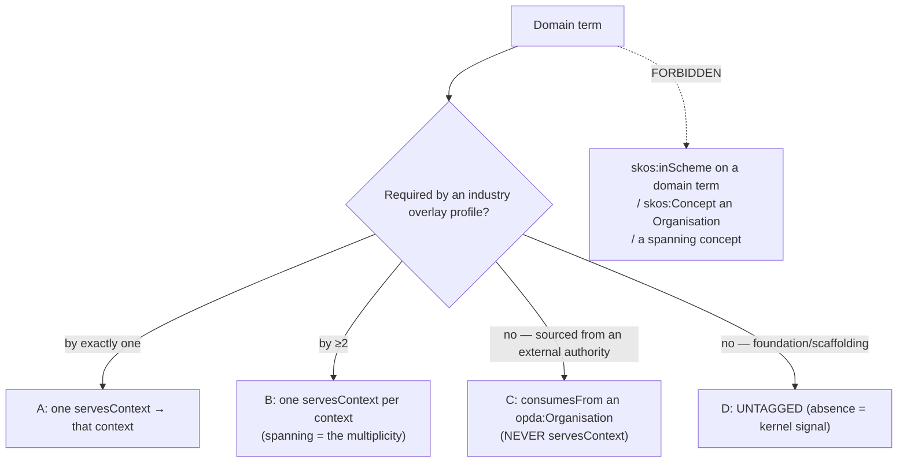

# Bounded-Context Scheme and Term→Context Mapping

## Context

[ODR-0019](./ODR-0019-bounded-context-representation.md) ratified the *representation pattern* — one `opda:` namespace, bounded contexts as a SKOS `skos:ConceptScheme`, membership via `opda:servesContext` (derived) + `opda:definedInContext`, gated by Rule 8 — but explicitly handed the concrete `skos:Concept` shapes and the mapping mechanism to a follow-on. This ODR is that follow-on: *which* concepts populate the scheme, what each carries, and how domain terms map into it. Nothing of this is emitted today — no `opda:BoundedContextScheme`, no context concepts, no `opda:servesContext`/`opda:definedInContext`. The only context predicate in the graph, `opda:overlaysContext`, is mis-targeted: `profiles.py:250` hardcodes the **profile-layer** IRI `<https://w3id.org/opda/profiles/foundation>` (verified), and only the `baspi5` profile is emitted at all — the other five form-profiles are not yet generated.

The 13 candidate contexts (`/modelling/bounded-contexts`) are not one kind of thing. Six are **industry bounded contexts** (Estate Agency, Conveyancing, Mortgage Lending, Surveying, Property Data Services, Property Technology) — each a perspectival community of practice that owns a SHACL overlay profile. Five are **upstream/conformist authorities** (HM Land Registry, Local Authority, MHCLG Material Information, DSIT/DIATF Identity, W3C Trust & VCs) — these are not perspectives our payloads enter through but external **organisations** whose published models PDTF conforms to; they own no overlay. Two are **spanning concerns** (Transaction lifecycle; Participants & roles) — cross-cutting subdomains already first-class in [ODR-0007](./ODR-0007-transactions-and-lifecycle.md) (a phase-space over a Relator) and [ODR-0006](./ODR-0006-agents-and-roles.md) (a RoleMixin family). Putting all three tiers in one bounded-context scheme would co-type a perspective, an agent, and an aspect — the category error [ODR-0019](./ODR-0019-bounded-context-representation.md) §4 forbids, one level up.

Deliberated as a Linked Data Council ([session-020](./council/session-020-bounded-context-scheme-and-mapping.md); Queen Kendall; DA Davis; panel Evans & Vernon, Gandon, Hendler, Baker, Cagle, Guizzardi). Unlike the ODR-0019 rounds, this one split (6 vs 11 vs 13 concepts); the Queen resolved the forks *against the headcount* on the verified operational and ontological facts.

## Decision

Model **one flat `skos:ConceptScheme` (`opda:BoundedContextScheme`) populated by the six industry contexts only**; keep upstream authorities OUT as `opda:Organisation`/`prov:Agent` reached by `opda:consumesFrom` (never `opda:servesContext`), and keep spanning concerns OUT as the ODR-0006/0007 structures they already are (their "spanning" surfaces as multiple derived `opda:servesContext` edges, not a declared concept); derive every term→context tag mechanically from the (corrected) `opda:overlaysContext` + `opda:requires` edges and leave scaffolding untagged — chosen because only the six industry contexts are perspectival communities that own overlays to derive from, while modelling upstream-as-context (an agent, not a perspective) or spanning-as-context (already homed) would assert structure no overlay or consumer backs and would require the hand-maintenance ODR-0019 outlawed.

## Rules

### 1. Scheme population — six industry contexts, flat

`opda:BoundedContextScheme a skos:ConceptScheme` contains exactly the six industry contexts as `skos:Concept`s, each `skos:inScheme` AND `skos:topConceptOf` the scheme (flat — they have no broader context). No `skos:Collection`, no `skos:broader`/`narrower`, no `opda:contextTier`, no sub-schemes at ratification. Mirrors the 23 existing value-schemes' house style.

```turtle
opda:BoundedContextScheme a skos:ConceptScheme ;
    rdfs:label "PDTF Bounded Contexts"@en ;
    skos:definition "The six industry bounded contexts of the UK PDTF, each owning a SHACL overlay profile (ODR-0010). Domain-term membership is DERIVED via opda:servesContext from opda:overlaysContext — never hand-authored except per ODR-0019 Rule 8."@en ;
    opda:hasSteward "OPDA Architecture WG"@en ;        # Literal, per value-scheme house style
    dct:source <https://w3id.org/opda/odr/ODR-0020> .

opda:ConveyancingContext a skos:Concept ;
    skos:inScheme opda:BoundedContextScheme ;
    skos:topConceptOf opda:BoundedContextScheme ;
    skos:prefLabel "Conveyancing"@en ;
    skos:definition "Legal transfer of estate; overlays ta6/ta7/ta10/lpe1."@en ;
    opda:hasSteward "Law Society / SRA / CLC"@en .

opda:SurveyingContext a skos:Concept ;
    skos:inScheme opda:BoundedContextScheme ;
    skos:topConceptOf opda:BoundedContextScheme ;
    skos:prefLabel "Surveying"@en ;
    skos:definition "Physical inspection and valuation; overlays piq."@en ;
    opda:hasSteward "RICS"@en .
# + EstateAgencyContext, MortgageLendingContext, PropertyDataServicesContext, PropertyTechnologyContext
```

### 2. Upstream authorities are Organisations, not contexts

The five upstream/conformist authorities are NOT members of `opda:BoundedContextScheme`. They are modelled as `opda:Organisation` (the Substance Kind already minted under [ODR-0006](./ODR-0006-agents-and-roles.md) §Q1, with a ratified identity criterion and merger exemplar) / `prov:Agent`. A domain term sourced from one links by **`opda:consumesFrom`** (the DDD Conformist relationship, pointing at the agent — which is what an upstream authority *is*) plus `dct:source` / `prov:wasAttributedTo` for provenance ([ODR-0009](./ODR-0009-claims-evidence-provenance.md)). They are NEVER `opda:servesContext` targets (no overlay → not derivable). An optional `opda:AuthoritativeSourceScheme` MAY catalogue them later (Rule 8 gate), but they never enter the bounded-context scheme.

```turtle
opda:HMLandRegistry a opda:Organisation, prov:Agent ; rdfs:label "HM Land Registry"@en .
opda:RegisteredTitle opda:consumesFrom opda:HMLandRegistry ;
    dct:source <https://www.gov.uk/government/organisations/land-registry> .  # NOT servesContext
```

### 3. Spanning concerns are derived, not declared

Transaction lifecycle and Participants & roles get NO `skos:Concept`. They remain the [ODR-0007](./ODR-0007-transactions-and-lifecycle.md) phase-space (a Phase over the Transaction Relator) and the [ODR-0006](./ODR-0006-agents-and-roles.md) RoleMixin family. A term's "spanning" status is **read off** the mapping — it is a term carrying `opda:servesContext` edges to more than one context — not asserted by membership of a cross-cutting concept. No `opda:CrossCuttingConcernScheme`; no `opda:sharedKernel` boolean.

### 4. The term→context mapping rule (four buckets)

| Bucket | Condition | Treatment |
|---|---|---|
| **A — single-context** | required by exactly one industry profile | one DERIVED `opda:servesContext` → that context |
| **B — spanning / kernel-in-use** | required by ≥2 industry profiles | one DERIVED `opda:servesContext` **per** requiring context (the multiplicity IS the spanning) |
| **C — upstream-sourced** | provenance is an external authority | `opda:consumesFrom` → an `opda:Organisation` (Rule 2); NEVER `opda:servesContext` |
| **D — untagged** | a foundation/scaffolding term **no profile requires** | **no edge** — absence-of-tag is the kernel/scaffolding signal |

**Home dimension (amended by [Session 022](./council/session-022-form-shacl-profile-convention.md), 2026-05-30; 6–0; council-ratified — greenfield, no WG — supersedes the [Session 021] "authored `opda:definedInContext` ownership layer", now WITHDRAWN).** Over the four *usage* buckets, a term's **home** is recorded with **standard predicates, not a bespoke one** ([ODR-0019](./ODR-0019-bounded-context-representation.md) Rule 5): **module-of-origin / concern → `rdfs:isDefinedBy`** (the owning module IRI — note modules partition by *concern*, not by the six contexts); **provenance → `dct:source`** (already emitted); **community-ownership → `dct:subject`** → a context concept, **authored-or-absent, NEVER derived** (not from `dct:source`, not from `servesContext` degree), and gated (Rule 8) to the non-derivable residue (**empty today**). `opda:definedInContext` is **RETIRED** — it reinvented these three published standards. Upstream-sourced terms link by **`opda:consumesFrom` → `opda:Organisation`** (bucket C — the one justified local predicate; no W3C term for the DDD Conformist relationship). Bucket D stays "untagged = kernel-or-scaffolding"; kernel terms are NEVER blanket-tagged "serves all six." `opda:servesContext` (usage) is a **derived dormant rule, never materialised** (Rule 5).

### 5. Derive-don't-declare + the concept/term firewall

Membership is **derived** from the profiles (single source of truth), via a dormant SHACL-AF rule ([ODR-0017](./ODR-0017-shacl-af-quality-rules-pattern.md)):

```sparql
CONSTRUCT { ?term opda:servesContext ?ctx }
WHERE { ?vc opda:overlaysContext ?ctx ; opda:requires ?term .
        FILTER( STRSTARTS(STR(?term), STR(opda:)) ) }
```

This presupposes the `profiles.py:250` fix (Rule 6). **Firewall (hard):** the six contexts ARE `skos:Concept`s `skos:inScheme` the scheme; a *domain term* (`opda:Address`) is NOT — it is an `owl:` term that points at a context via the `opda:servesContext` annotation. A domain term MUST NEVER carry `skos:inScheme opda:BoundedContextScheme`.

**Authority + derivation note (amended by [Session 022](./council/session-022-form-shacl-profile-convention.md), 2026-05-30; 6–0; council-ratified — greenfield, no WG — supersedes the [Session 021] note).** The architect's Claim B is upheld and the apparatus simplified to standards: a form is a **DCAP** (its SHACL shapes ARE the Description Set Profile); its constraint table IS a **DCTAP** (`profiles.py` already runs the TAP→SHACL step); the profile→base association **needs no new construct** — ODR-0010's SHACL overlay already establishes it (the shapes' `sh:targetClass` reference the `opda:` base directly). **No W3C PROF, no profile object, no `opda:overlaysContext`** (governance directive 2026-05-30 — *"the SHACL overlay IS the form; stop wrapping it"*). Which community a form serves is one standard triple on the form graph (`dct:subject`/`dct:publisher` → its context concept). `opda:requires` is **dropped as redundant** — a SHACL processor already enumerates required terms from the `sh:path` of every `sh:minCount ≥ 1` shape. `opda:servesContext` is a **derived dormant rule, never materialised** (run on demand; activates only on a named term-grain consumer per ODR-0019 Rule 8). **No membership fact is stored as authored data.**

**Firewall (S022 — F1 retained; the S021 F2/F3 + total-cover-CI are dropped).** One standing guard: **F1** — no non-`skos:Concept` carries `skos:inScheme opda:BoundedContextScheme` (domain terms point at contexts via `dct:subject` or the derived rule, never via scheme membership). S021's F2/F3 + total-cover-CI policed a *stored* `servesContext` and an *authored* `definedInContext` that S022 deletes, so they collapse; the only residual coverage check is the trivial "every owned term carries `rdfs:isDefinedBy` (its module)."

### 6. `opda:overlaysContext` correction + UFO categories + identity criterion

*Amended by [Session 022](./council/session-022-form-shacl-profile-convention.md) + governance directive (2026-05-30): the `overlaysContext`→industry-context-concept correction below is **SUPERSEDED — `opda:overlaysContext` is DROPPED entirely** (not re-pointed, not replaced by a PROF/profile-object layer). The form↔base link is structural (the shapes' `sh:targetClass` on the `opda:` base — ODR-0010, already established); the form↔community link is one standard triple on the form graph (`dct:subject`/`dct:publisher` → its context concept). Governance: "the SHACL overlay IS the form — stop wrapping it." This **moots** the `profiles.py:250` bug. The UFO-category + identity-criterion content below stands unchanged.*

`profiles.py:250` currently emits `opda:overlaysContext <…/profiles/foundation>` — a profile-LAYER IRI. The rule: each profile's `opda:ValidationContext` MUST point `opda:overlaysContext` at its **industry `…Context` concept** (baspi5→`opda:EstateAgencyContext`; ta6/7/10/lpe1→Conveyancing; fme1→MortgageLending; piq→Surveying; rds/oc1/llc1/con29→PropertyDataServices; base→PropertyTechnology). The profile-layer link, where still needed, is a distinct predicate (`opda:profileLayer`), not overlaysContext.

**UFO meta-category (per A9):** a bounded context is an **anti-rigid, perspectival Role-like community of practice** (a SKOS facet, never a Kind); an upstream authority is a **Substance Kind** (`opda:Organisation`); a spanning concern is a **Phase**-space over a **Relator** (lifecycle) plus a **RoleMixin** family (participants). The three are different categories, which is why only the first populates the scheme.

**Identity criterion over named hard cases (per A9):** a term's bucket is fixed by *how it reaches the graph*, tested against — (i) `floodRisk` (required by `piq`+`ta6` → **B**, two `servesContext` edges); (ii) `RegisteredTitle` / OC1 register data (authority-sourced → **C**, `consumesFrom opda:HMLandRegistry`, never a context); (iii) `DiagnosticExemplar` / `GeneratorRun` (no profile requires them → **D**, untagged); (iv) "HMLR" itself (an Organisation, NOT a `opda:HMLRContext` concept). **Artefact realisation (per A9):** `opda:BoundedContextScheme` + the six concepts (a new generator module, emitted to `opda-contexts.ttl`); the SHACL-AF CONSTRUCT rule (Rule 5) in the shapes graph; the `profiles.py:250` fix.

### Anti-patterns



- **Never** make an upstream authority a `skos:Concept` in the bounded-context scheme — it is an `opda:Organisation` (Rule 2).
- **Never** mint a `skos:Concept` for a spanning concern — it is derived (Rule 3).
- **Never** give a domain term `skos:inScheme opda:BoundedContextScheme` (Rule 5 firewall).
- **Never** blanket-tag kernel terms "serves all six"; **never** hand-author `servesContext` (Rule 4).
- **Never** leave `opda:overlaysContext` pointing at the profile-layer IRI (Rule 6).

## Alternatives

- **One scheme of 13 (industry + upstream + spanning), tiered by `skos:Collection` or `opda:contextTier`.** Rejected: co-types a perspective, an agent, and an aspect under one membership predicate; upstream/spanning have zero overlay edges so their membership is non-derivable hand-maintenance. The tiering is forward-compatible (admissible later behind the firewall) but unwarranted now.
- **Eleven concepts (industry + upstream as marked Conformist peers).** Rejected: the DDD Conformist *relationship* is real but is satisfied by `opda:consumesFrom` → an Organisation; making the authority a context concept commits the agent/perspective category error and is still non-derivable.
- **A separate `opda:CrossCuttingConcernScheme` for the two spanning concerns.** Rejected: double-models what ODR-0006/0007 already own; "spanning" is cheaper and truer as the multiplicity of derived edges.
- **Blanket-tag shared-kernel classes `servesContext` all six (or a `SharedKernel` sentinel).** Rejected: "all" is a fiction that drifts on the seventh profile; absence-of-tag already signals kernel.
- **Hand-author `servesContext` membership.** Rejected: reintroduces the drift-prone second source of truth ODR-0019 outlawed; derive from the profiles instead.

## Consequences

- **Emit (ADR work).** A new generator module emits `opda:BoundedContextScheme` + the six concepts to `opda-contexts.ttl`. Tracked by the follow-on **ADR-0026**.
- **Fix the bug + build the profiles.** `profiles.py:250` re-points `opda:overlaysContext` at the industry context concept; the five not-yet-emitted form-profiles (ta6/7/10, lpe1, fme1, piq, rds, oc1, llc1, con29…) wire to their contexts as they are written — a real backlog this ODR surfaces.
- **Derivation ships dormant.** The SHACL-AF CONSTRUCT rule (Rule 5) is authored under ODR-0017 and shipped dormant behind [ODR-0019](./ODR-0019-bounded-context-representation.md) Rule 8; it switches on at the first named term-grain consumer.
- **Upstream + spanning need no new ontology now.** Upstream reuse `opda:Organisation`/`prov:Agent` + `opda:consumesFrom`; spanning reuse ODR-0006/0007.
- **No version surface added.** The scheme rides `foundation.ttl`'s `owl:versionIRI`; per-concept lifecycle uses the ODR-0011 §5a deprecation pattern. `skos:exactMatch` to steward vocabularies is DEFERRED (cross-vocab gate).
- **`odr-review`/CI guards.** Flag any `skos:inScheme opda:BoundedContextScheme` on a non-`skos:Concept`; flag any upstream authority typed `skos:Concept`; flag any hand-authored `opda:servesContext`.

## References

- **Methodology**: [ODR-0001](./ODR-0001-linked-data-council-methodology.md) (A9 per-kind discipline).
- **Council provenance**: [session-020 — Bounded-Context Scheme and Mapping](./council/session-020-bounded-context-scheme-and-mapping.md) (Queen Kendall; DA Davis; forks resolved against headcount on verified facts).
- **Implementation-planning follow-on, then convention correction**: [session-021](./council/session-021-bounded-context-implementation-plan.md) proposed an authored `opda:definedInContext` ownership layer + D1/D2 + firewall-to-CI. **[session-022 — Form↔SHACL Profile Convention](./council/session-022-form-shacl-profile-convention.md)** (2026-05-30; Queen Baker; DA Davis; 6–0) **reversed the bespoke parts**: `definedInContext` **retired** (→ `rdfs:isDefinedBy` + `dct:source` + gated `dct:subject`); `opda:requires` + `opda:overlaysContext` **dropped** (the SHACL overlay's `sh:targetClass`/shapes already give base + required terms — ODR-0010, **no wrapper/PROF layer added**); form↔community = a standard `dct:subject`/`dct:publisher` triple on the form graph; `opda:servesContext` = a derived query (run on demand, not stored); F2/F3 + total-cover-CI dropped (F1 kept). **Governance directive (2026-05-30): no profile-object/PROF layer — the SHACL overlay IS the form.** Verdict: **no new ODR** — amend in place (Rules 4–6, above). **Amendments council-ratified — greenfield, no WG.**
- **Parent**: [ODR-0019](./ODR-0019-bounded-context-representation.md) (the representation pattern — single namespace, SKOS contexts, `opda:servesContext`/`opda:definedInContext`, Rule 8 gate this record refines).
- **Foundations cited**: [ODR-0006](./ODR-0006-agents-and-roles.md) (`opda:Organisation` Kind + RoleMixin family — home of upstream and the participants concern); [ODR-0007](./ODR-0007-transactions-and-lifecycle.md) (the lifecycle phase-space — home of the transaction concern); [ODR-0009](./ODR-0009-claims-evidence-provenance.md) (`prov:wasAttributedTo`/`dct:source` for `opda:consumesFrom`); [ODR-0010](./ODR-0010-overlay-profile-mechanism.md) (overlay profiles — the `opda:overlaysContext`/`opda:requires` substrate the mapping derives from); [ODR-0017](./ODR-0017-shacl-af-quality-rules-pattern.md) (SHACL-AF rule pattern — the derivation's home); [ODR-0011](./ODR-0011-enumeration-vocabularies.md) (SKOS scheme + steward house style); [ODR-0002](./ODR-0002-ontology-language-adoption.md) (vocabulary catalogue — where the scheme registers).
- **Implementation**: ADR-0026 (bounded-context scheme generator + `overlaysContext` correction + dormant derivation rule).
- **Industry context map**: `/modelling/bounded-contexts`.
- **W3C / spec**: SKOS Reference (Miles & Bechhofer 2009) — `skos:ConceptScheme`, `skos:topConceptOf`; PROV-O (Moreau & Missier 2013) — `prov:Agent`, `prov:wasAttributedTo`; DCMI Terms — `dct:source`.
- **DDD / UFO**: Evans 2003 (Conformist, Published Language, Context Map); Guizzardi 2005 Ch. 4 (Kind vs Role vs Phase vs Relator); OntoClean (Guarino & Welty).
- **Related**: programme anchor [ODR-0003](./ODR-0003-pdtf-ontology-programme.md).
