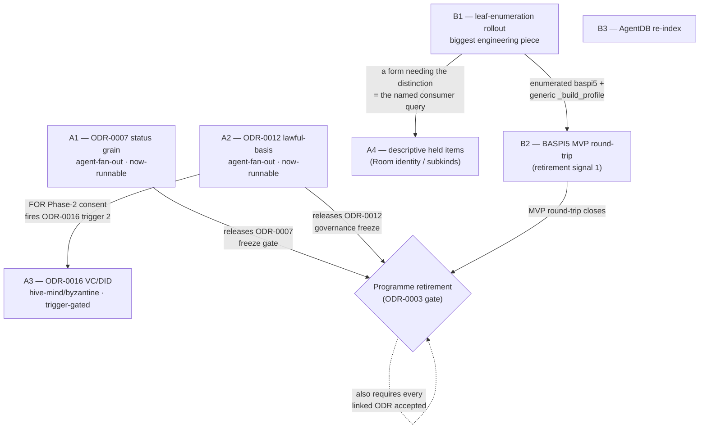

# Outstanding Work & Modelling Register — OPDA Ontology Programme

This is the accurate standing register of everything left in the OPDA ontology programme, grounded in the ODR/ADR corpus. It supersedes a deleted Council record (the mistaken "schema-accommodation scope" session) which wrongly recast the corpus's deliberate consumer-driven/YAGNI deferrals as "wait for a future PDTF schema version" gates.

Dated 2026-05-31. The deferrals below are **councilled, consumer-driven discipline** over a fixed `opda:` TBox (overlays are SHACL-only form-profiles per [ODR-0010](../ontology/odr/ODR-0010-overlay-profile-mechanism.md); class-per-overlay was rejected unanimously at S001) — they are **not** future-data gates.

## A. Outstanding modelling work (councilled, consumer-gated — NOT future-data gates)

- **A1 — Status state-machine grain — ✅ RESOLVED** (Council [session-032](../ontology/odr/council/session-032-status-scheme-grain.md), 2026-05-31: single scheme, 5–0–0, DA fully withdrawn; [ODR-0007](../ontology/odr/ODR-0007-transactions-and-lifecycle.md) freeze gate lifted; ODR-0011 grain + SET-test re-open trigger recorded). The "single-scheme-vs-per-role status (OPEN)" question — one status state-machine across the transaction and all roles, or one per role — is deferred to ODR-0007's own follow-up council session. The SKOS scheme(s) it resolves to live in [ODR-0011](../ontology/odr/ODR-0011-enumeration-vocabularies.md) either way. ODR-0007's TBox **freeze gate** depends on it (alongside the ODR-0005 identity-criterion gate). Convening config in [§E](#e-council-convening-swarm-configuration); run order in [§F](#f-execution-plan).
- **A2 — Lawful-basis / consent / purpose class vocabulary — ✅ RESOLVED/RECONCILED** (Council [session-033](../ontology/odr/council/session-033-governance-class-vocab.md), 2026-05-31; per-question 3–2, DA Allemang HELD). [ODR-0012](../ontology/odr/ODR-0012-data-governance-layer.md): session-012 already adopted the lawful-basis layer via reference-not-import — the stale "Live question / not frozen" body is reconciled; a model-constraining DPV lattice (`owl:import`) and consent/policy *instances* stay Phase-2; the `opda:PurposeScheme` model is ratified with **emission gated on its first driver**; three verified emission defects → **B4**. Original framing: DPV Phase-1 annotation-only is the adopted governance floor; Pandit's recorded **live dissent** holds that the `dpv:hasLegalBasis` / `dpv-gdpr:Consent` / purpose-taxonomy **class vocabulary** is TBox-expressible and was wrongly deferred. ODR-0012 does not resolve it; it is recorded as live and is **ruled by a follow-up Council session**. The governance TBox is not frozen until then. Convening config in [§E](#e-council-convening-swarm-configuration); run order in [§F](#f-execution-plan).
- **A3 — W3C-VC / DID binding ([ODR-0016](../ontology/odr/ODR-0016-w3c-vc-did-compatibility.md)).** The claims **envelope** is already modelled — [ODR-0009](../ontology/odr/ODR-0009-claims-evidence-provenance.md)'s PROV-O backbone + the `opda:assuranceLevel` SKOS layer. What is deferred is the substantive `cred:`/`did:` **binding** (`opda:Claim` ↔ `cred:VerifiableCredential`, Issuer/Holder/Verifier role bindings, DID method, signature suites, status lists, JSON-LD context, eIDAS/ToIP mapping). It is named-and-deferred behind **three** activation triggers (ODR-0009 Q8 surfaces real VC-side decisions; Pandit's Phase-2 consent-receipt ambition lands; a real wallet / DID-method / eIDAS consumer enters scope) — i.e. gated on a real consumer, not on future schema content. ODR-0016 already carries a full convening spec (§"Convening constraints for Session 016"); it is the **hive-mind escalation** candidate — see [§E](#e-council-convening-swarm-configuration) for the mode + verbatim CLI and [§F](#f-execution-plan) for its trigger-gating.
- **A4 — Descriptive held items (Council sessions 025–030).** All consumer-gated:
  - **ODR-0008 §Q2a a/b UFO sub-modules** ([ODR-0008](../ontology/odr/ODR-0008-property-descriptive-attributes.md)). Judged NOT load-bearing at [session-029](../ontology/odr/council/session-029-r2-ufo-axis-load-bearing.md) (0–6–0); `ODR-0008a/b/c` not spawned. `a/b` are deferred on a **sharpened conjunctive trigger**: (i) a committed gUFO `rdf:type` typing pass with straddlers/re-sorters adjudicated to one cell — *now executed* as [ADR-0034](../adr/ADR-0034-gufo-property-typing-pass.md) (§B/§D below) — **AND** (ii) a named consumer query or SHACL validator whose answer/report changes when the typing is removed. `ODR-0008c` is struck from the UFO axis (it reduces to `rdfs:domain opda:LegalEstate`; Kendall's four-way re-routed to its encumbrance-cardinality trigger).
  - **ODR-0024 Room/Building class promotion** ([ODR-0024](../ontology/odr/ODR-0024-curated-category-g-walk-dispositions.md) R10). `opda:Room` (8–0) and `opda:Building` (7–1) are **not** promoted to Kinds; the `roomDimensions.rooms[]` group is modelled by-value as `opda:RoomDimension` (emitted, [ADR-0033](../adr/ADR-0033-room-dimension-value-structure-emission.md)). Held dissents re-open only on an **identity fact** (a Building instance exercising the Replacement witness; a stable room token + a re-identifying query).
  - **ODR-0024 School / HealthCareFacility subkinds** (R4). For the first cut these collapse into the `opda:NearbyFacility` genus (band-specific properties SHACL-scoped per overlay); the precise-bearer Subkind split (+ `opda:TransportNode`) is held-as-live (Guizzardi dissent), re-open trigger = a consumer query needing per-band typing.
  - **`opda:UnitOfLengthScheme`** (R10 held dissent — Guizzardi/Davis/Guarino). `opda:length`/`opda:width` are `xsd:decimal`, metres-by-`rdfs:comment`, reusing the `opda:area` precedent; no length-unit scheme is minted absent a consumer.
  - Note: the overlay leaf-enumeration rollout (**B1**) is the natural **consumer** that would fire several of these — if a form's SHACL profile needs the distinction, that is the named query, not a schema change.

## B. Outstanding engineering work (tracked, largely unblocked)

- **B1 — Overlay-profile leaf-enumeration rollout ([ADR-0029](../adr/ADR-0029-overlay-profile-emitter-generalisation-and-rollout.md) gaps 1+2).** **gap (2) ✅ DONE** (commit `8753784`): baspi5 routed through the generic spec-driven `_build_profile`, byte-identical, special-case removed. **gap (1) ✅ EXECUTED 2026-06-01** (Council [session-034](../ontology/odr/council/session-034-overlay-leaf-enumeration-discipline.md), REVISE — eager-on-bindable). The bind-only-what-exists resolver (`tools/opda-gen/src/opda_gen/inputs/leaf_resolver.py`) enumerated **28 forms** (12 ref-carrying mains + 16 NTS2 extensions): **224 bindable leaves enumerated, 1095 GAPped** by reason (no-predicate / no-domain / multi-domain / ref-collision / collider-ambiguous), each form with an **emitted per-form gap register** (`dct:description`). A leaf binds IFF its resolved local-name (name-match + ODR-0024 `COLLAPSED`) is an emitted `opda:` predicate with a single `rdfs:domain` (→ `sh:targetClass`), else GAP (never fabricated/guessed); each property shape's `dct:source` is the **JSON-pointer schema-leaf-path anchor** (`<$id>#/path`, [ODR-0022](../ontology/odr/ODR-0022-descriptive-layer-import-strategy.md) G2, S034-amended). **oc1/llc1 stay thin** (ODR-0008d register extracts, held; byte-identical). The 7 as-built fixes landed; G3 forms-authority generalised to the overlay `$id` (252→746 addressable form leaves, 0 unaddressable, 0 doubly-bound); baspi5/oc1/llc1 byte-identical; all 6 CI gates + the full `opda-gen` pytest suite green. Enumeration does **not** discharge G3's worked-query limb (per-consumer; Davis withdrawal condition).
- **B2 — BASPI5 MVP round-trip demonstration ([ODR-0003](../ontology/odr/ODR-0003-pdtf-ontology-programme.md) retirement termination signal 1).** Demonstrate the full chain: `pdtf-transaction.json` → loaded SHACL profile → rendered BASPI form via DASH → validated transaction with `dct:source` traceability. This is one of the two retirement conditions (the other being every linked ODR `accepted`).
- **B3 — AgentDB re-index (`adr-index` / `odr-index`).** ADR-0033 and ADR-0034 were authored while the `ruflo` MCP was disconnected; their AgentDB registration is pending an index run. The MCP is now reconnected, so re-index the recent records (the file + frontmatter edges are authoritative in the interim). *(Now also covers session-032/033 + the records they amended.)*
- **B4 — Governance-surface emission fix (3 verified defects; Council [session-033](../ontology/odr/council/session-033-governance-class-vocab.md); [ADR-0005](../adr/ADR-0005-deferred-work-register.md) §G).** A generator fix to the *accepted, emitted* ODR-0012/0018 surface (ADR-0012/0018 emitter; byte-identity-affecting → regenerate + re-pin + tests; independent of any new class vocab): **D1** correct the `dpv:` namespace binding in `SpecialCategoryPIIWithoutLawfulBasisShape` (core `dpv:`, not `dpv-pd:`) — it currently checks a non-existent predicate; **D2** split the overloaded `opda:lawfulBasis` (carries PD-categories in agent annotations vs lawful bases elsewhere); **D3 (highest value)** emit `opda:isPIIBearing true` on the PII Kinds (Person/Address/Organisation/evidence) so `PIIWithoutDPVCoAnnotationRule` fires — the Phase-1 PII-co-annotation floor is currently **unenforced** (the rule matches zero classes).

## C. Deferred by directing-authority discipline (leave unless a named trigger fires)

- **ODR-0021 F1–F10 form-layer enhancements** ([ODR-0021](../ontology/odr/ODR-0021-deferred-form-profile-layer-enhancements.md)) — W3C PROF profile typing, content-negotiation by profile, DCTAP-as-published-artefact, explicit profile→base predicate, reified profile node, per-form versioning, etc. Governed by the binding directive **"the SHACL overlay IS the form; stop wrapping it."** Each is ratified-as-deferred behind a named **consumer/interop** trigger and MUST NOT be built until its trigger fires; a "this is the idiomatic way" argument is explicitly **not** a trigger.
- **SSSOM / cross-vocabulary mapping** — owned by [ODR-0011](../ontology/odr/ODR-0011-enumeration-vocabularies.md) (and catalogued Defer-tier in [ODR-0002](../ontology/odr/ODR-0002-ontology-language-adoption.md); Cagle's ≈5–4 dissent recorded). SSSOM earns its place only for **external**-vocabulary mappings (FIBO / INSPIRE / HMLR RDF / ESCO / ISO 3166), behind a named external-mapping consumer; a Phase-3.5 audit session is flagged to adjudicate admission.
- **Out-of-scope vocabularies (QUDT, GeoSPARQL, FIBO, schema.org, SOSA/SSN, DCAT-AP)** — Defer-tier per [ODR-0002](../ontology/odr/ODR-0002-ontology-language-adoption.md). Units carry `xsd:decimal` + SKOS-typed units instead of QUDT (ODR-0008 §"Out of scope"); GeoSPARQL's deferral home is [ODR-0015](../ontology/odr/ODR-0015-address-and-geography.md) with four named admission triggers (title-extents / LLC1 polygons / INSPIRE direct ingest / search-radius queries).
- **ODR-0005 `expected-report.ttl` pairing** ([ODR-0005](../ontology/odr/ODR-0005-property-land-identity-crux.md)) — deferred to a follow-up author-only session for when the SHACL shapes graph crystallises; each diagnostic exemplar then becomes a CI regression test per ODR-0004 §8a.

> Note (record-accuracy): the prior framing attributed "out-of-scope vocabs (QUDT/GeoSPARQL/FIBO)" to ODR-0014. ODR-0014 is actually *Vocabulary Catalogue Amendments* (status: superseded), retained as a historical anchor; the out-of-scope deferrals live in ODR-0002 (catalogue) with GeoSPARQL homed in ODR-0015. Corrected here against the records.

## D. Decisions recorded this cleanup (2026-05-31)

- **The mistaken "schema-accommodation scope" council record was reverted.** It mischaracterised the deferrals in §A as schema-evolution gates; the record was deleted and its ripple edits expunged across ODR-0003, ODR-0008, ODR-0016, ODR-0023, ODR-0024, ADR-0005, ADR-0034.
- **WG-gate removal retained.** This is a greenfield first-cut data model with no Working Group; the directing authority + Linked Data Council are the ratifying bodies. The `proposed`→`accepted` flips and the "greenfield, no WG" reframings stand (directing-authority-directed).
- **ADR-0034 / gUFO typing retained, re-grounded.** The gated gUFO `rdf:type gufo:Quality` pass over the 5 uncontested Quale-in-Region Property leaves (annotation graph only, [ODR-0010](../ontology/odr/ODR-0010-overlay-profile-mechanism.md) §Q7a) stands — executed as the dedicated work-item that [session-029](../ontology/odr/council/session-029-r2-ufo-axis-load-bearing.md) Q5 (6–0–0) envisioned, logged at [ADR-0005](../adr/ADR-0005-deferred-work-register.md) §G25. It is **decoupled** from the reverted record and re-grounded purely on session-029 Q5 + §G25.
- **CI fixes retained.** BASPI5 G19 real-`baspi5Ref` correction (`A1.1.5`), G3 sanctioned-shared-ref reconciliation (`_SCHEMA_SANCTIONED_SHARED_REFS`), and the data-dictionary-absent test-skip in `test_leaf_categoriser.py`. Recorded in [ADR-0005](../adr/ADR-0005-deferred-work-register.md) §G (per §G1 — no silent reconciliation).

## E. Council convening + swarm configuration

The three open-modelling councils in §A1–A3 are the live ones the descriptive-layer roadmap ([ODR-0023](../ontology/odr/ODR-0023-descriptive-layer-follow-on-council-roadmap.md)) has not already discharged. Their convening configuration is derived here per [ODR-0001](../ontology/odr/ODR-0001-linked-data-council-methodology.md) §Format-tiers + §Consensus-mode-framework, and follows ODR-0023's escalation rule verbatim.

### The escalation rule (ODR-0023 §"Hive-mind escalation")

> Default is **`agent-fan-out`** — the runtime is **Agent Teams** (`TeamCreate` + parallel `Agent` spawns + `SendMessage` cross-talk; the S021/S022/S023 pattern). No `hive-mind init` at all. Hive-mind is avoided by default because it is **materially more expensive** (persistent hive state + programmatic consensus rounds); per-question votes are independent tallies the Queen composes from teammates' working-file votes, with no consensus engine.

Escalate a council from `agent-fan-out` to a hive-mind `consensus-mode` **only** if, at the pre-flight scope check, its verdict is genuinely:

- **conditional** — one question's verdict is contingent on another → `hive-mind/byzantine`; or
- **typed-output** — it must emit a **structured object a downstream tool consumes** (a generator, a linter, an LLM retriever) → `hive-mind/typed-output`.

If a scope check escalates, the fired trigger is recorded in that session's convening block. This also fits the methodology's pending hive-mind-pilot intent (ODR-0001 §Two-artefact-discipline — B2 `hive-mind/byzantine` / B3 `hive-mind/typed-output`).

### Swarm-config flags (derived from the live `ruflo` CLI)

These are the **real** flags, captured from `ruflo hive-mind spawn --help` and `ruflo swarm init --help` (run via the documented `npx -y @sparkleideas/ruflo@latest …` fallback — `ruflo` is not on this machine's PATH). They are quoted so the configs below are runnable verbatim. Note ODR-0001 §Substrate-operations: inside an active session with a running MCP server, prefer the MCP tools (`mcp__ruflo__hive-mind_init`, etc.); the CLI form is the env-without-MCP fallback.

- **`ruflo hive-mind spawn`** — `--queen-type strategic|tactical|adaptive` (default `strategic`); `--consensus majority|weighted|byzantine|raft|gossip|crdt|quorum` (default `byzantine`; interpolated into the §6 parameterization header of the queen prompt); `--topology` (default `hierarchical-mesh`; renders the §6 coordination-protocol block); `-n, --count` (default 1); `-r, --role worker|specialist|scout`; `--worker-types` (comma-separated, round-robin: `researcher,coder,analyst,tester,architect,reviewer,optimizer,documenter,specialist,coordinator,monitor`); `--claude` (launch Claude Code); `-o, --objective`; `--dry-run`; `--non-interactive`; `--mcp-config`.
- **`ruflo hive-mind init`** — `-t, --topology` (default `hierarchical-mesh`) and `-c, --consensus` (the same seven algorithms; default per `init` is `raft`). The escalation CLI ODR-0023 names verbatim is `hive-mind init -c byzantine` (or `-c quorum --quorum-preset supermajority`).
- **`ruflo swarm init`** (advisory bookkeeping only — the deliberation runs on Agent Teams) — `-t, --topology` (default `hierarchical-mesh`); `-m, --max-agents` (default 15); `--auto-scale` (default true); `-s, --strategy`; `--new` (ADR-0098 — force a new swarm even if a matching one is running) + `--reason`.

### Per-council convening config

Format tier and `consensus-mode` per council; the substrate column mirrors ODR-0023's convening-config table style. Queen / DA / panel are **proposed** where the source ODR did not fix them (A1, A2); for A3 they are pulled verbatim from ODR-0016 §"Convening constraints for Session 016".

| Council | Question it resolves | Format tier | `consensus-mode` | Runtime substrate (the cheap path) | Proposed Queen + DA + panel |
|---|---|---|---|---|---|
| **A1 — ODR-0007 status grain** | Single status state-machine across the transaction + all roles, **vs** one per role (the §Rules "Single-scheme-vs-per-role status (OPEN)"). Feeds the SKOS scheme(s) in ODR-0011; releases ODR-0007's freeze gate. | Reduced→Full Council (one substantive question with a credible split; promote to Full if the role-founding axis re-opens) | **`agent-fan-out`** | Agent Teams + `SendMessage` (team `council-007b`) | *Proposed* (session-007 voices): Queen **Guizzardi** (owns the Relator/Phase founding); DA **Allemang** (pragmatic "one scheme is enough; don't multiply state-machines"); panel **Guarino** (identity of a Phase across role-plays), **Kendall** (enterprise lifecycle patterns), **Isaac/Miles** (SKOS scheme granularity), **Davis** (gov-data status precedent) |
| **A2 — ODR-0012 lawful-basis vocab** | Is the lawful-basis / consent / purpose **class** vocabulary (`dpv:hasLegalBasis`, `dpv-gdpr:Consent`, purpose taxonomy) TBox-expressible **now** or Phase-2? (Pandit's live recorded dissent, §Rules "Live question".) | Reduced→Full Council (single contested boundary; Full if the purpose-taxonomy modelling itself splits) | **`agent-fan-out`** (per-question vote on Pandit's dissent; *see typed-output note below*) | Agent Teams + `SendMessage` (team `council-012b`) | *Proposed* (session-012 voices): Queen **Pandit** (owns DPV; brings the dissent) **or** a neutral Queen (**Kendall**) with Pandit as panellist if author-as-Queen is undesirable; DA **Kendall** or **Allemang** (the "reference-not-import floor is right; defining the class vocab now is premature TBox" position — the floor Pandit dissents from); panel **Guarino** (the ODRL/instances-only contradiction), **Iannella** (ODRL/consent), **Cagle** (SHACL on consent shapes), **Baker** (purpose-taxonomy SKOS governance) |
| **A3 — ODR-0016 VC/DID binding** | The 9 scope sub-questions (Claim binding → Issuer/Holder/Verifier roles → DID method → signature suites → status lists → JSON-LD context → truth-makers → consent receipts → eIDAS/ToIP mapping). | **Full Council** (verbatim from ODR-0016: substantive decision; credible VC-purist-vs-pragmatist split) | **`hive-mind/byzantine`** (the 9 sub-questions are interdependent) — **OR `hive-mind/typed-output`** (it must emit a structured binding spec a downstream generator/catalogue consumes). See recommendation below. | `hive-mind init` (the escalation path — **not** Agent Teams) | **Verbatim from ODR-0016 §Convening:** Queen **Luc Moreau** (PROV-O↔VC continuity) *or* a VC-WG voice (**Sporny / Reed**); DA **Harshvardhan Pandit** (strongest opponent of an under-scoped binding); extended panel **Sporny / Reed** (VC-WG) + **Guarino** (the Truth-Maker question); standing slice **Allemang / Hendler / Cagle** |

### Per-council justification

- **A1 (ODR-0007) → `agent-fan-out`.** The open question is a *single* modelling vote — one state-machine vs per-role — whose verdict does not hinge on any other question's outcome, and whose product is a SKOS-scheme-count decision routed to ODR-0011, **not** a structured object a generator consumes at session time. Neither escalation trigger fires; it is a standalone per-question tally, exactly the `agent-fan-out` criterion. (If the deliberation re-opens the role-founding axis it promotes to Full Council, but the *consensus-mode* stays fan-out.)
- **A2 (ODR-0012) → `agent-fan-out`.** Pandit's dissent is one yes/no boundary question (is the class vocab TBox-expressible now?); its verdict is independent of any sibling and the output is an adoption-now/Phase-2 ruling, not a consumed artefact. **Typed-output note:** *if* the council resolves FOR adopting now **and** decides to emit the purpose-taxonomy + lawful-basis class vocab as a structured spec a generator immediately consumes, that emission step (not the dissent vote) would justify a `hive-mind/typed-output` follow-on. Absent that, fan-out is correct and cheaper. Note A2's outcome can itself fire ODR-0016 trigger 2 (Pandit Phase-2 consent receipts) — see §F.
- **A3 (ODR-0016) → `hive-mind` escalation (recommend `byzantine`).** This is the natural escalation candidate on **both** triggers. (i) *Conditional:* the 9 sub-questions form a dependency chain — the Claim binding (`opda:Claim rdfs:subClassOf cred:VerifiableCredential`?) determines the Issuer/Holder/Verifier role bindings, which constrain the DID method, which constrains the signature suites, which constrain the status-list and JSON-LD-context choices. (ii) *Typed-output:* the verdict must emit a **structured binding spec** the generator/catalogue (`cred:`/`did:` prefixes, JSON-LD context URI, signature-suite admission list) consumes downstream. The conditional chain is the dominant property, so **`hive-mind/byzantine`** is recommended; `hive-mind/typed-output` is the alternative if the council is run primarily to *produce the spec object* rather than to *resolve the chain*. Either way this is the methodology's pending hive-mind-pilot fit. Verbatim CLI (env-without-MCP fallback):

```bash
# Recommended: conditional 9-question chain → byzantine
ruflo hive-mind init -t hierarchical-mesh -c byzantine
ruflo hive-mind spawn --claude \
  --queen-type strategic \
  --consensus byzantine \
  --topology hierarchical-mesh \
  -n 8 \
  --worker-types researcher,architect,reviewer,analyst,specialist,coordinator \
  -o "Session 016 — W3C VC/DID binding: resolve the 9 interdependent scope sub-questions (Claim binding, Issuer/Holder/Verifier roles, DID method, signature suites, status lists, JSON-LD context, truth-makers, consent receipts, eIDAS/ToIP mapping)"

# Alternative: run primarily to emit the structured binding spec → typed-output
ruflo hive-mind init -t hierarchical-mesh -c quorum --quorum-preset supermajority
```

> Inside a live session with the MCP server up, use `mcp__ruflo__hive-mind_init({ topology: "hierarchical-mesh", consensus: "byzantine", queenType: "strategic" })` then `mcp__ruflo__hive-mind_spawn(...)` rather than the CLI (ODR-0001 §Substrate-operations — CLI inside an active MCP session risks lock contention).

## F. Execution plan

A sequenced plan grounded in the records. Dependencies and gating are shown explicitly; the mermaid flowchart summarises them (theming is owned by the site's `client.js` — bare `:::paletteName` only, no `%%{init}%%`/`classDef`).

1. **Now-runnable councils — A1 (ODR-0007) and A2 (ODR-0012).** Both are deferred-to-follow-up by their **own ratified text** (ODR-0007 §Rules "deferred to this ODR's own follow-up council session"; ODR-0012 §Rules "must be ruled by a follow-up Council session") — **no external trigger gates them**. Either order; suggested **A1 then A2** (A1 unblocks the ODR-0007 freeze gate and the ODR-0011 status scheme, the more entangled of the two). Both run `agent-fan-out` per §E (Agent Teams; no hive-mind init).
2. **A3 council — ODR-0016 (VC/DID binding).** **Trigger-gated** — it runs only when one of its 3 activation triggers fires (ODR-0009 Q8 surfaces real VC decisions; Pandit Phase-2 consent receipts land; a real wallet/DID/eIDAS consumer enters scope) **or** on a deliberate directing-authority go. Note the cross-link: **A2's outcome can itself fire trigger 2** — if A2 resolves FOR Pandit's Phase-2 consent-receipt class vocabulary, that *is* "Pandit's Phase-2 ambition lands", which activates Session 016. Runs as a **hive-mind escalation** (`byzantine` recommended) per §E.
3. **B1 — overlay-profile leaf-enumeration rollout** ([ADR-0029](../adr/ADR-0029-overlay-profile-emitter-generalisation-and-rollout.md) gaps 1+2). 30 thin profiles → enumerate each form's leaves into SHACL (`sh:path`/`sh:minCount`/`dct:source` per [ODR-0022](../ontology/odr/ODR-0022-descriptive-layer-import-strategy.md) G2/G3); refactor baspi5's bespoke ~420-line `_build_baspi5_profile` into the generic `_build_profile` (output-neutral — `baspi5.ttl` stays byte-identical). **Largely unblocked now** — its gate (the descriptive-layer walk) has landed (Category-G 239/239). Biggest single engineering piece; discharges the G3 per-form round-trip for every form. **May surface the A4 held triggers** (Room identity / school subkinds — §A4): if a form's SHACL profile needs the distinction, that is the named consumer query that would spawn a descriptive council (R3 identity-fact / R4-style subkind split), **not** a schema change.
4. **B2 — BASPI5 MVP round-trip demonstration** ([ODR-0003](../ontology/odr/ODR-0003-pdtf-ontology-programme.md) retirement signal 1). The full chain `pdtf-transaction.json` → loaded SHACL profile → rendered BASPI form via DASH → validated transaction with `dct:source` traceability. **Depends on B1** (the generic `_build_profile` + the enumerated baspi5 leaves are what the round-trip exercises).
5. **B3 — AgentDB re-index** (`adr-index` / `odr-index`; MCP now reconnected). ADR-0033/ADR-0034 were authored while the MCP was disconnected. **Do this after the doc churn settles** so the re-index registers the *corrected* corpus (this plan, the reverted-record ripples in §D), not a mid-edit state.
6. **Programme retirement check** ([ODR-0003](../ontology/odr/ODR-0003-pdtf-ontology-programme.md) gate). Retire only when **both** conditions hold: the MVP round-trip closes (**B2**) **and** every linked ODR is `accepted`. The latter folds in the §A councils — A1/A2 release their ODRs' freeze gates; A3 stays `proposed` and is reviewed at the retirement gate if no trigger ever fired (ODR-0016 §Consequences).

### Dependency / gating relationships


